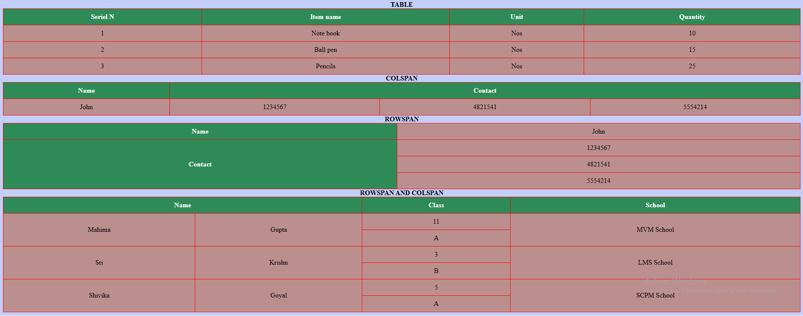

HELLO WORLD<br>
*ITALIC* 1*<br>
**STRONG** 2*<br>
***STRONG ITALIC*** 3*<br>
**`TEXTCOLOR`** **`** BACKTICK<br>
**```** PROGRAMMING LANGUAGE<br>
~~1000~~ 900 **~tilde** <br>

[visit youtube](https://www.youtube.com/ "just right") **``[ alt text ]( url "hoover")``**<br>
MDimage<br>
 **````**<br>

html img tag<br>
<br>

TABLES<br>
TABLE | GOES | HERE
| --- | --- | --- |
| ONE | TWO | THREE |<br>
QUOTE >
> KEEP WORK HARDER <br> 

- **- hyphen to bullet point**<br><br>
Horizontal lines **`--- *** <hr>`**<br>


### ### HEADING 3
## ## HEADING 2
# # HEADING 1


```html    
    Hello world <!--comment single & multipleline  Merci Danke und Wunderbar--> HTML stands for hyper text markup language, Created by Tim Berners Lee in 1991, Html used for create web pages. 
```
<br>

```html
<!DOCTYPE html>
    <html>
        <head><!--head of browser -->
            <title>Learn Html</title>
        </head>
        <body>
            <h1><h2><h3><h4><h5></h6> heading tags 
            <p><b>BOLD</b></p> pargraph and bold
            <br> break tag dont need to close
            <i>italics</i>
            <em>emphasize italics</em>
            <mark>highlight in yellow background</mark>
            <small>Small sized letters</small>
            <del>deleted line over letters</del>
            <ins>insert or underlined</ins>
            <sup>superscript slightly above</sup> 
            <sub>subscript slightly below</sub>
            <strong>'i'bold</strong>bold<b></b>
            <blockquote cite="https://en.wikipedia.../Eiffel_Tower">specifies a section that is quoted from another source</blockquote>
            <p><cite>Lettre philosophique</cite> by: Voltaire</p> 
        </body>
    </html>
```
### CSS - Cascading style sheet and html
```html
    
    1. Inline : style attribute inside HTML element
    <h1 style="color: red;">Learn html css</h1>

    2. Internal : <style> element inside <head> tag 
    <head>
        <style>
            h2{color:cornflowerblue;}
            h3{color: blueviolet;}
        </style>
    </head>
    <body>
        <h2>Test</h2>
        <h3>Test</h3>
    </body>

    3. External : <link> element to link an external css file
    <head>
        <link rel="stylesheet" href="styles.css">
    </head>
```
styles.css external file
```css
body{
    background-color: brown;
}
p{
    color: yellow;
    background-color: black;
}
```
HTML colors
```html
Color name = eg: red, tomoto, gold, pink
RGB = red, green, blue values. eg : rgb(200, 100, 115)
HEX = hexadecimal value. eg: #e30b6c
HSL = hue, saturation, lightness values. eg: hsl(10, 90%, 65%)
RGBA = rgb with alpha channel/transparancy value. eg: rgba(200, 100, 115, 0.4)
HSLA = hsl with alpha channel/transparancy. eg: hsla(10, 90%, 65%, 0.5)
```
```CSS

{
    color: blueviolet;/*Colorname*/ 
}
{
    color: rgb(242, 113, 15);/*RGB*/
}
{
    color: #ff3369;/*HEX*/
}
{
    color: hsl(235, 100%, 60%); /* HSL hue ° degree removed)*/ 
}
{
    background-color: rgba(165, 42, 42, 0.1); /* RGBA 0.1 transparency percentage added*/
}
{
    background-color: hsla(205, 98%, 50%, 0.3);/*HSLA 0.3 transparency*/
}
```
## TABLES


```html
<table style="width: 100%;" border="1";><!-- Table -->
        <caption>TABLE</caption>
        <tr>
            <th>Seriel N</th>
            <th>Item name</th>
            <th>Unit</th>
            <th>Quantity</th>
        </tr>
        <tr>
            <td>1</td>
            <td>Note book</td>
            <td>Nos</td>
            <td>10</td>
        </tr>
        <tr>
            <td>2</td>
            <td>Ball pen</td>
            <td>Nos</td>
            <td>15</td>
        </tr>
        <tr>
            <td>3</td>
            <td>Pencils</td>
            <td>Nos</td>
            <td>25</td>
        </tr>
    </table>
    <table style="width: 100%;" border="1"><!-- Table COLSPAN -->
        <caption>COLSPAN</caption>
        <tr>
            <th>Name</th>
            <th colspan="3">Contact</th>
        </tr>
        <tr>
            <td>John</td>
            <td>1234567</td>
            <td>4821541</td>
            <td>5554214</td>
        </tr>
    </table>

    <table style="width: 100%;" border="1"><!-- Table ROWSPAN -->
        <caption>ROWSPAN</caption>
        <tr>
            <th>Name</th>
            <td>John</td>
        </tr>
        <tr>
            <th rowspan="3">Contact</th>
            <td>1234567</td>
        </tr>
        <tr>
            <td>4821541</td>
        </tr>
        <tr>
            <td>5554214</td>
        </tr>
    </table>

    <table style="width: 100%;" border="1"><!-- Table ROWSPAN AND COLSPAN -->
        <caption>ROWSPAN AND COLSPAN</caption>
        <thead>
            <tr>
                <th colspan="2">Name</th>
                <th>Class</th>
                <th>School</th>
            </tr>
        </thead>
        <tbody>
            <tr>
                <td rowspan="2">Mahima</td>
                <td rowspan="2">Gupta</td>
                <td>11</td>
                <td rowspan="2">MVM School</td>
            </tr>
            <tr>
                <td>A</td>
            </tr>
            <tr>
                <td rowspan="2">Sri</td>
                <td rowspan="2">Krishn</td>
                <td>3</td>
                <td rowspan="2">LMS School</td>
            </tr>
            <tr>
                <td>B</td>
            </tr>
            <tr>
                <td rowspan="2">Shivika</td>
                <td rowspan="2">Goyal</td>
                <td>5</td>
                <td rowspan="2">SCPM School</td>
            </tr>
            <tr>
                <td>A</td>
            </tr>
        </tbody>
    </table>
```
CSS tabels
```css
table{
    border: 1px solid red;
    border-collapse: collapse;
    background-color: rosybrown;
}
th,td{
    text-align: center;
    padding: 10px;
}
th{
    background-color: seagreen;
    color: white;
}
caption{
    font-weight: bold;
}
```
## Links / Image
```html css
<a href="https://www.google.fr/" target="_blank" title="clickme">Google</a> <!--external link-->
<a href="contact.html" target="_blank">Contact</a> <!--internal-->

 <!--internal imagie-->
 <!--external-->
```
```css
a:link{
    text-decoration: none; /*removed underline link*/
}
a:hover{
    color: red; /*hoover color link*/
}

body{
    background-image: url('/images/cat.jpg');           /*background CSS single img*/
    background-repeat: no-repeat;
    background-size: 100% 100%;
    background-attachment: fixed;
}
```
clickable img
```html
<a href="https://www.google.fr/" target="_blank" title="clickme">
    
</a>
```
